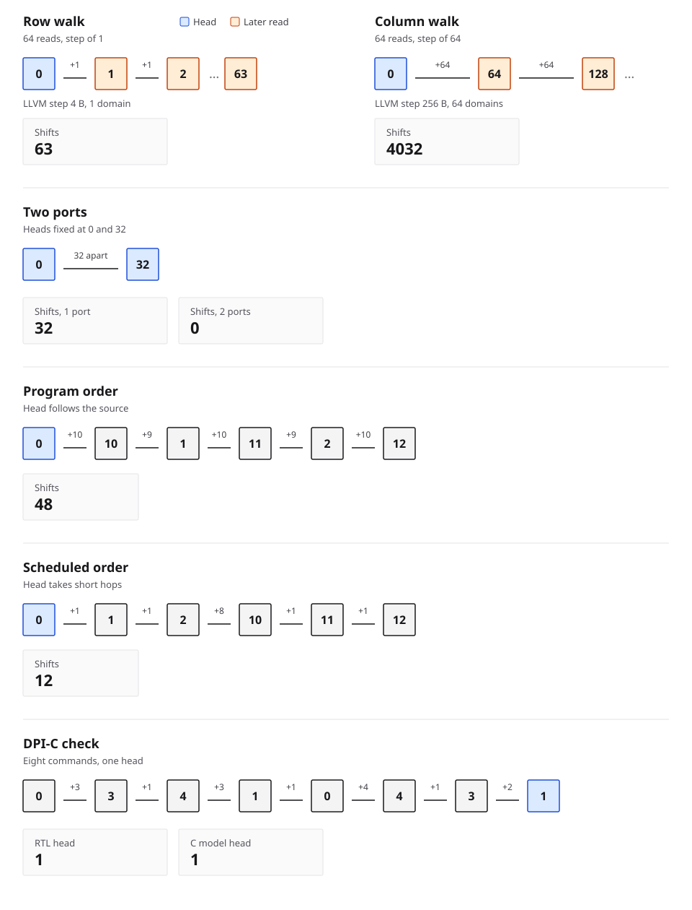

# Portwalk guide

Plain-language notes for the tape diagram, for what LLVM is doing in this repo, and for how that lines up with NIC DMA, DPDK rings, firmware, PCIe, and the networking stack.

## Where the head walks

Boxes are slots on the nanowire. The number on each hop is how far the head moves. The picture shows the step; `make demo` prints the same totals. The column total is 63 hops of 64, because the head is already on the first slot.

**Row and column.** A row is the next slot every time, so each hop is +1. A column of a 64-wide row is 64 slots away, so each hop is +64. Same 64 reads, very different travel. The LLVM pass reads that step out of the loop (4 bytes versus 256 bytes) and turns it into these hop counts.

**Two ports.** A second head already sits on slot 32. Asking for slot 32 costs 32 shifts with one head and 0 with two. The compiler has to be told how many heads the chip has, the same way a driver is told how many DMA queues a NIC has.

**Gathers, the NIC case.** Program order and scheduled order are the same six reads: slots 0, 10, 1, 11, 2, and 12. Nothing about the values depends on the order, because each read touches a different slot.

That is the same freedom a NIC has with DMA descriptors. The ring says "fetch buffer 0, then 10, then 1, …" but those fetches do not depend on each other, so the DMA engine may issue them in an order that keeps the bus, or here the head, from bouncing. Walking 0 → 10 → 1 → 11 → 2 → 12 costs 48 shifts. Walking 0 → 1 → 2 → 10 → 11 → 12 costs 12. The scheduler picks the ready read closest to where the head already is.

A write is a different descriptor. Suppose the bundle is "write slot 5, read slot 1, read slot 5, read slot 2." The read of slot 5 has to stay behind the write, or it would return the old value. The reads of slots 1 and 2 are still free to go first. A NIC applies the same rule: independent DMA reads can be reordered, and a write of an address stays ahead of a later read of that address. In `src/schedule.c` that later operation waits for the most recent earlier one on the same slot whenever either side is a write.

**DPDK rings.** The same burst is what a DPDK poll-mode driver posts. `rte_eth_tx_burst` and `rte_eth_rx_burst` hand the NIC a short list of descriptors. Each descriptor names a buffer address. The driver writes that list into the hardware ring and updates the tail register, the doorbell. Slots `0, 10, 1, 11, 2, 12` are six of those buffer addresses. Inside one burst they do not depend on each other, so the device may pull them in the order that stops the head bouncing: 48 shifts in the order the burst was filled, 12 after the sort.

A write still pins that ring. If one descriptor stores slot 5 and a later one loads slot 5, the load stays behind the store. DPDK already respects the same ownership rule: a core does not read a descriptor the NIC has not written, and it does not reuse an mbuf the NIC still owns.

`rte_ring` is the other ring, the software one between lcores. It is a FIFO of pointers. Enqueue order is dequeue order, so it is the handoff of a burst across the pipeline, after any reorder. The reorder itself belongs in the burst, which is also where the mempool shows up. Buffers taken from one pool sit next to each other, like the row walk of +1. Buffers scattered across the address space are the column walk of +64.

**DPI-C check.** The bottom row is the eight commands in `rtl/tb_rtm.sv`. The blue box is where the head stops. The SystemVerilog controller and the C model both report head 1.

## How LLVM works in this project

LLVM is the compiler machinery under clang. This repo uses three pieces of it, and nothing else.

**1. The C becomes a list of simple instructions.** `kernels/ir_kernels.c` is ordinary C. `clang -O2 -emit-llvm` writes `build/ir_kernels.ll`. That file is LLVM IR: loads, stores, adds, and branches, with the C syntax already gone. A loop like `s += A[i * 64 + j]` shows up as a pointer that moves by a fixed number of bytes each trip. The pass reads that file. It does not run the C program.

**2. A pass is a small program that walks the IR.** `llvm/CostPass.cpp` is that program. For each loop it asks one question: every time around, how far does this address jump? LLVM already has an analysis called ScalarEvolution that recovers the pattern of a loop counter ("this pointer grows by 256 bytes per trip, and the trip count is 64"). The pass turns that byte step into slots on the tape. A 4-byte step is one float, one slot, 63 shifts. A 256-byte step is 64 slots, 4032 shifts.

**3. `opt` is LLVM's tool for running passes.** `make demo` also loads the same pass into `opt` as a plugin (`-passes=rtm-cost`). The plugin line in the demo is that check: LLVM's own tool and our standalone tool print the same hop counts.

When the address is `vals[idx[i]]`, ScalarEvolution stops. `idx[i]` is data, filled in at runtime, so there is no fixed step to print. The pass marks the load `indirect` and leaves the bundle to the scheduler, which runs once the addresses are known. That split is the same one a driver already lives with: some layout is visible when the code is compiled, and the real buffer pointers show up later, when the descriptors are posted.

## How this lines up with NIC, firmware, PCIe, and the stack

The racetrack head is a new device. The control problem around it is a familiar one.

| You already do this | The same job in Portwalk |
| --- | --- |
| NIC DMA ring. Descriptors name buffers. Independent reads can be reordered so the engine stops seeking around. | `src/schedule.c`. Descriptors name tape slots. The six-address gather drops from 48 shifts to 12. |
| DPDK `rte_eth_tx_burst` / `rte_eth_rx_burst`. One burst is a short hardware ring of buffer addresses. `rte_ring` between lcores stays in enqueue order. | The gather is that burst. Reorder is inside the burst. `rte_ring` only carries the burst to the next lcore. Buffers from one mempool are the row walk; scattered buffers are the column walk. |
| A write descriptor stays ahead of a later read of the same buffer, or the read returns stale data. | A write of a slot stays ahead of a later read of that slot. |
| Firmware owns a device FSM: idle, kick a command, wait until the engine finishes, read the result. | `rtl/rtm_ctrl.sv`. One command in flight. Shift one slot per cycle, then read or write. That is the shape of a memory-mapped engine a Cortex-class firmware loop would program. |
| The host posts work and the device pulls it. On a NIC that post crosses PCIe: descriptors and buffers sit in host memory, the device DMAs them, completions come back. | The "descriptor" here is a target slot. Static strides are decided in the compiler, before anything is posted. Runtime gathers are ordered on the device side, once the addresses exist. This repo does not model PCIe packets. It models the ordering decision that sits on the device end of that post. |
| The networking stack fills packet buffers. The driver turns them into a descriptor batch and rings the doorbell. Ordering and batching happen at that boundary, after the stack and before the wire. | The compiler is the early, static half of that boundary. The port scheduler is the late half, the driver looking at a filled ring. |
| Line coding on a link (64b/66b and its relatives) breaks up long runs of the same bit so the physical layer stays locked. | `src/rll.c` stuffs a 1 into a long run of zeros. On this memory a long zero run is a gap with no skyrmion, which is the same class of physical constraint as a run-length limit on a wire. |
| A logic analyzer on a firmware bring-up shows cycle, event, and the signals you care about. | `build/la_trace.csv` is that dump for the head: cycle, shift or read, head, slot. |

DPI-C is the co-sim habit from firmware bring-up. Verilator runs the SystemVerilog controller. Each command is also applied to the C model through the DPI bridge in `src/dpi_bridge.c`. The run passes when both heads and the returned data agree. That is the same bar as a block-level sim where the RTL and the firmware's golden model have to match before you trust either.
